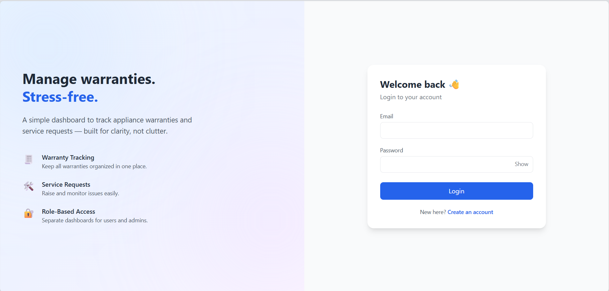
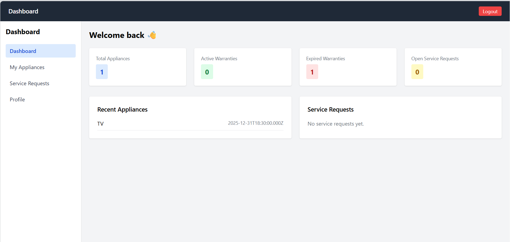
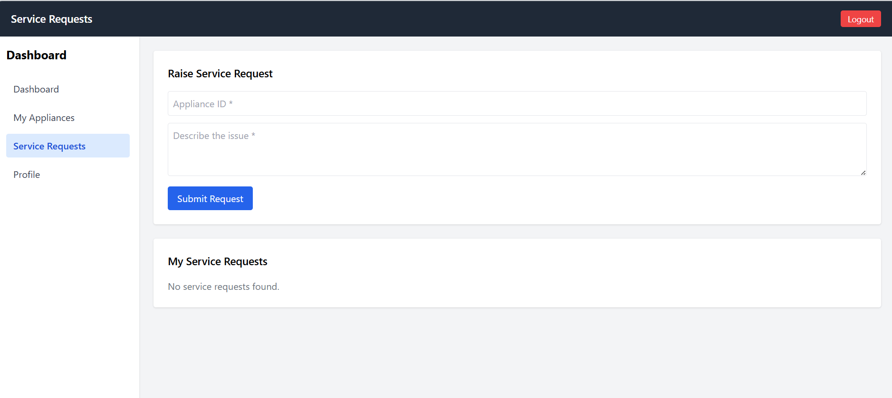
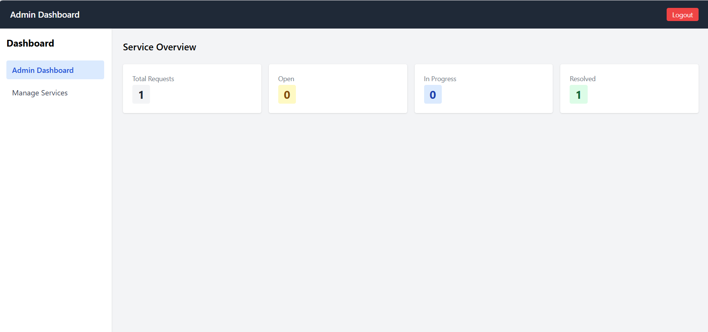
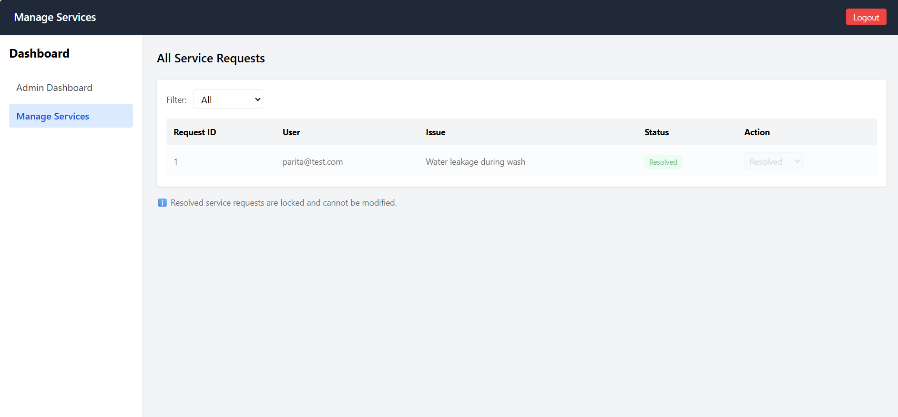

# 🛠️ Service Warranty Tracker (PERN Stack)

A full-stack web application to manage appliance warranties and service requests, built using the **PERN stack (PostgreSQL, Express, React, Node.js)** with role-based access for users and admins.

This project focuses on real-world workflows such as warranty tracking, service request handling, and admin-level management with proper authorization, database normalization, and user-friendly UX.

---

## 🚀 Features

### 👤 User Features
- Add and manage appliances with warranty details
- View warranty status with **expiry countdown (Expires in X days)**
- Raise service requests for appliances
- Track service request status (Open / In Progress / Resolved)
- Clear visual indicators for expired and active warranties

### 🛠️ Admin Features
- View all service requests across users
- Filter service requests by status
- Prioritized view (Open → In Progress → Resolved)
- Update service request status
- **Resolved requests are locked** and cannot be modified
- Visual status badges, tooltips, and attention indicators

---

## 🔐 Role-Based Access Control
- **Users** can manage only their own appliances and service requests
- **Admins** can manage all service requests
- Authorization enforced at:
  - Backend (JWT + middleware)
  - Frontend (protected routes)

---

## 🧱 Tech Stack

- **Frontend:** React, Tailwind CSS
- **Backend:** Node.js, Express.js
- **Database:** PostgreSQL
- **Authentication:** JWT (JSON Web Tokens)
- **API Style:** REST
- **API Testing:** Postman

Postman was used to test and validate all backend APIs during development.

---

## 🗄️ Database Design (Normalized)

This project uses **4 normalized tables**:

```text
users
└── appliances
    └── service_requests
        └── service_logs


### Table Overview
- **users** – Stores user credentials and roles (user/admin)
- **appliances** – Stores appliance details and warranty information per user
- **service_requests** – Tracks service issues raised for appliances
- **service_logs** – Maintains status change history for service requests

This structure avoids redundancy, maintains clean relational integrity, and supports scalable service tracking.

---

## 🧠 Key Design Decisions

- Enforced immutable state for resolved service requests
- Used relational joins instead of duplicating user identifiers
- Server-side authorization with role-based middleware
- Separated service logs from service requests for better auditing
- UX enhancements such as:
  - Warranty expiry countdown
  - Status badges with visual dots
  - Tooltips for locked actions
  - Priority sorting for admin workflows

---

## 📸 Screenshots

### Login Page


### User Appliances Dashboard


### User Service Requests


### Admin Services Dashboard


### Resolved Service Locked State


---

## ⚙️ How to Run Locally

### 1️⃣ Clone the repository
git clone https://github.com/Parita-31/service-warranty-tracker
cd service-warranty-tracker


### 2️⃣ Backend Setup
cd server
npm install
npm run dev

Create a .env file inside the server folder with the following:
PORT=5000
DB_HOST=localhost
DB_USER=your_db_user
DB_PASSWORD=your_db_password
DB_NAME=service_warranty_tracker
JWT_SECRET=your_secret_key


### 3️⃣ Frontend Setup

Open a new terminal:
cd client
npm install
npm start


The application will start at http://localhost:3000.
---
## 📌 Future Enhancements

Pagination for admin service requests
Search and filtering by user or appliance
Email reminders for warranty expiry
Service analytics dashboard

## 👩🏻‍💻 Author
Parita Dave
Information Technology Undergraduate